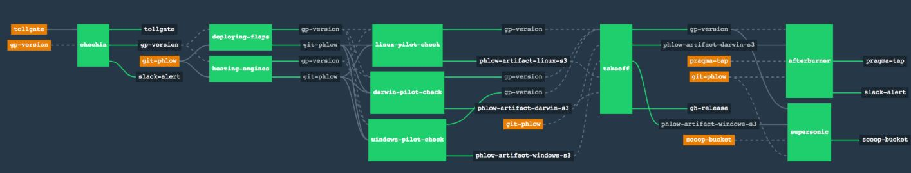

# 04-vcf-synergy-fullstack

The goal is to create a pipeline that automate the full provisionning process: provisionning the server in oneview and make it available in w VCF workload domain.

I'm currently finalizing a pipeline where I use concourse-ci + vault + ansible

