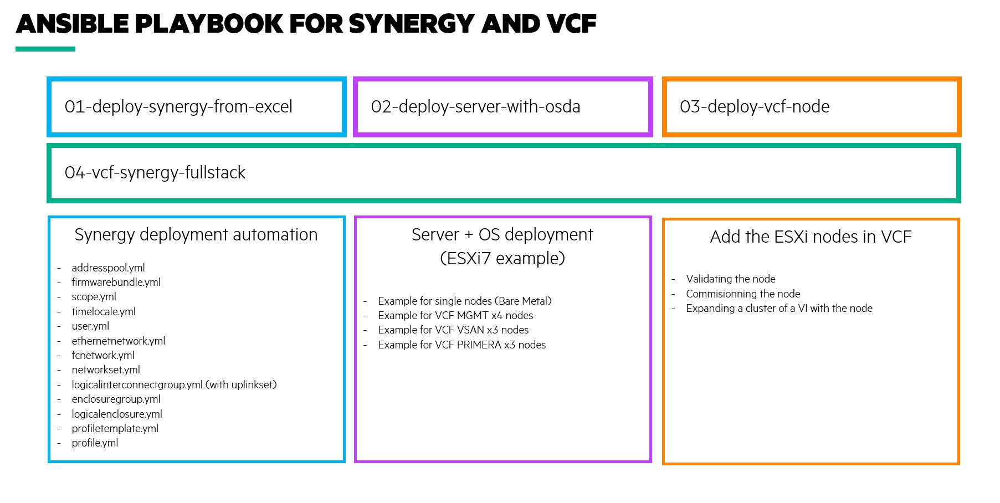

# OBS NGP POC with HPE

This repository contains ready-to-use ansible playbooks and scripts to automate tasks.
The environnment already contains a VM ready-to-use. If you want a quick start, juts connect to it:
```bash
ssh admin@10.15.60.206
tmux attach -t obs
```
Otherwise, you can follow the instruction here: [00-prepare-your-vm](00-prepare-your-vm/README.md)



## Use cases
- [01-deploy-synergy-from-excel](01-deploy-synergy-from-excel/README.md)
Deploy Synergy fromwith input from a excel file. This playbooks can used to automate the deployment of a ne synergy. This is not applicable for the POC as the platform has already been configured. 

- [02-deploy-server-with-osda](02-deploy-server-with-osda/README.md)
Deploy a server profile from a template + install the OS based on a kickstart.

- [03-deploy-vcf-node](03-deploy-vcf-node/README.md)
Deploy a server from a template + install the OS + commision the node in vcf + add the node to the VI Workload domain


## Miscellanous

- [HPE Oneview API](https://techlibrary.hpe.com/docs/enterprise/servers/oneview5.2/cicf-api/en/index.html)
- [HPE Primera API](https://support.hpe.com/hpesc/public/docDisplay?docLocale=en_US&docId=emr_na-a00088912en_us)
- [Cohesity API](https://developer.cohesity.com/apidocs-641.html#/rest)
- [VCF API](https://code.vmware.com/apis/921/vmware-cloud-foundation)