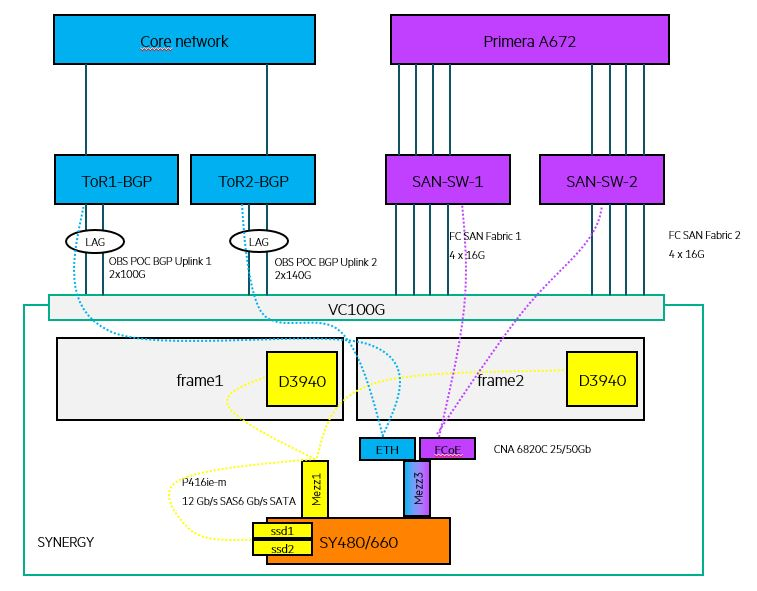

# OBS NGP POC with HPE

This repository describe the tests plan for the POC including:

- Synergy OneView automation
- Primera automation
- Cohesity
- VMWare Cloud Foundation
- OSDA





## Target audience

TODO

## Prerequisites

TODO

## Quick Start


### VCF

#### BGP routing
<epc_sw5950_b1r14_2>disp bgp routing ipv4

 Total number of routes: 17

 BGP local router ID is 2.2.2.2
 Status codes: * - valid, > - best, d - dampened, h - history
               s - suppressed, S - stale, i - internal, e - external
               a - additional-path
       Origin: i - IGP, e - EGP, ? - incomplete

     Network            NextHop         MED        LocPrf     PrefVal Path/Ogn

* >  2.2.2.2/32         127.0.0.1       0                     32768   ?
* >  10.6.57.0/24       10.6.57.20      0                     32768   ?
* >  10.6.57.20/32      127.0.0.1       0                     32768   ?
* >e 10.15.65.0/24      10.15.66.2      0                     0       65003?
*  e                    10.15.66.3      0                     0       65003?
* >  10.15.66.0/24      10.15.66.254    0                     32768   ?
*  e                    10.15.66.2      0                     0       65003?
*  e                    10.15.66.3      0                     0       65003?
* >  10.15.66.254/32    127.0.0.1       0                     32768   ?
* >  10.24.0.0/16       10.24.34.202    0                     32768   ?
* >  10.24.34.202/32    127.0.0.1       0                     32768   ?
* >e 100.64.176.0/31    10.15.66.2      0                     0       65003?
*  e                    10.15.66.3      0                     0       65003?
* >e 192.168.11.0       10.15.66.2      0                     0       65003?
*  e                    10.15.66.3      0                     0       65003?
* >e 192.168.31.0       10.15.66.2      0                     0       65003?
*  e                    10.15.66.3      0                     0       65003?

#### cleanup the cloudbuilder
```bash
https://kb.vmware.com/s/article/75172
ssh cloud-builder
vi /data/pgdata/pg_hba.conf
uncomment the line
local   replication     all                                     trust

systemctl restart postgres
sudo psql -U postgres -d bringup -h /home/postgresql/
delete from execution;
delete from "Resource";
\q
```
### Synergy : efuse a blade

```bash
curl https://packages.microsoft.com/config/rhel/7/prod.repo |  sudo tee /etc/yum.repos.d/microsoft.repo
sudo yum makecache
sudo yum install powershell
pwsh
PS /root> Install-Module hponeview.500
PS /root> $az1=Connect-HPOVMgmt -Appliance 10.7.9.20 -UserName admin -Password obs@cicGVA1234!
PS /root> Get-HPOVServer -ApplianceConnection $az1 | Get-HPOVAlert -State active | Set-HPOVAlert -Cleared

PS /root> Get-HPOVEnclosure
$encl1 = Get-HPOVEnclosure -Name "CZ20040WV4-frame1"
Reset-HPOVEnclosureDevice -Component Device -DeviceID 10 -Enclosure $encl1 -EFuse
Reset-HPOVEnclosureDevice -Enclosure $enclosure -Component Device -DeviceID 1

PS /root> Get-HPOVEnclosure
$encl2 = Get-HPOVEnclosure -Name "CZ20040WYK-frame2"
Reset-HPOVEnclosureDevice -Component Device -DeviceID 6 -Enclosure $encl2 -EFuse
Reset-HPOVEnclosureDevice -Component Device -DeviceID 7 -Enclosure $encl2 -EFuse


curl -k -i -H "accept: application/json" -H "content-type: application/json" -d '{"userName":"admin","password":"obs@cicGVA1234!"}' -X POST https://synergy.obs.hpecic.net/rest/login-sessions
curl -k -H "accept: application/json" -H "content-type: application/json" -H "auth: LTI3MTExODk0MTc5Ogwh9xtVHRPsskRskrZpG13qA2mmpGmV" -X GET https://synergy.obs.hpecic.net/rest/server-hardware -o server.xml

https://monpostit.fr/billet/serveur/incidents-serveur/efuse-reset-sur-une-lame-hpe-synergy/
```

## Detailed Step-by-Step

I have break down each steps:

- [00-deploy-hardware](00-deploy-hardware/README.md)
- [01-create-golden-image](01-create-golden-image/README.md)
- [02-create-oneview-server-template](02-create-oneview-server-template/README.md)
- [03-provision-bare-metal-server](03-provision-bare-metal-server/README.md)
- [04-deploy-kubespray](04-deploy-kubespray/README.md)
- [05-customize-kubernetes](05-customize-kubernetes/README.md)
  - Istio
  - Calico
  - Velero
