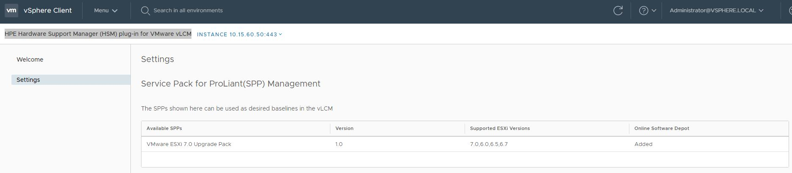
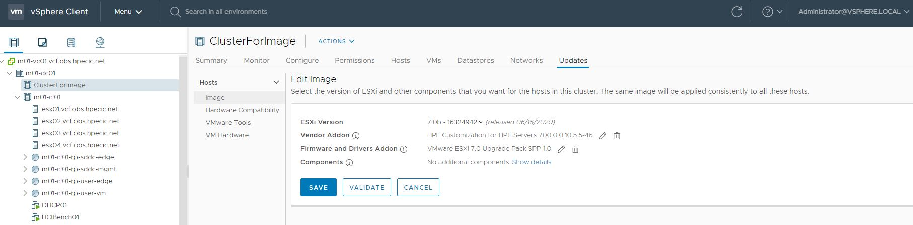
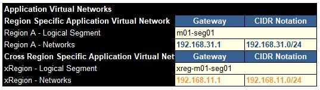

# How TO

## Synergy & OneView tips
### efuse a blade (reset the blade, simulating a remove/insert in the chassis)
```bash
curl https://packages.microsoft.com/config/rhel/7/prod.repo |  sudo tee /etc/yum.repos.d/microsoft.repo
sudo yum makecache
sudo yum install powershell
pwsh
PS /root> Install-Module hponeview.500
PS /root> $az1=Connect-HPOVMgmt -Appliance $IP -UserName admin -Password PASSWORD
PS /root> Get-HPOVServer -ApplianceConnection $az1 | Get-HPOVAlert -State active | Set-HPOVAlert -Cleared

PS /root> Get-HPOVEnclosure
$encl1 = Get-HPOVEnclosure -Name "CZ20040WV4-frame1"
Reset-HPOVEnclosureDevice -Component Device -DeviceID 10 -Enclosure $encl1 -EFuse
Reset-HPOVEnclosureDevice -Enclosure $enclosure -Component Device -DeviceID 1

PS /root> Get-HPOVEnclosure
$encl2 = Get-HPOVEnclosure -Name "CZ20040WYK-frame2"
Reset-HPOVEnclosureDevice -Component Device -DeviceID 6 -Enclosure $encl2 -EFuse
Reset-HPOVEnclosureDevice -Component Device -DeviceID 7 -Enclosure $encl2 -EFuse
```

### Export/Import Synergy config - METHOD 1

In this method, the input model is a existing Synergy upand running we want to import and export to another Synergy.
This method is using the powershell module.

```bash

# Keep your secret - https://devblogs.microsoft.com/powershell/secret-management-preview-2-release/
Install-Module -Name Microsoft.PowerShell.SecretsManagement -RequiredVersion 0.2.0-alpha1 -AllowPrerelease
Install-Module Microsoft.PowerShell.SecretManagement -AllowPrerelease
Import-Module Microsoft.PowerShell.SecretsManagement
Test-SecretVault BuiltInLocalVault
--> this module is not yet cross-support platform (only Windows)
--> to investigate later


# Clean the current synergy configuration - 2 choices
## 1st choice - use the hard method, using the factory reset (keep the network setting if you don't want to go on site)
ssh composer > factory reset

## 2nd choice - use the soft method using HPOneView module. This order is important !
Documentation: https://hpe-docs.gitbook.io/posh-hpeoneview/cmdlets/v5.20/library/convertto-hpovpowershellscript 

# Connect to OV
$ov2clean=Connect-HPOVMgmt -Appliance $oneview -UserName $username -Password $password -Force -Confirm:$false
Get-HPOVComposerNode


# Delete Server-Profile
Get-HPOVServerProfile -ApplianceConnection $ov2clean | Remove-HPOVServerProfile -Force -Confirm:$false

# Delete Server-Profile-Template
Get-HPOVServerProfileTemplate -ApplianceConnection $ov2clean | Remove-HPOVServerProfileTemplate -Force -Confirm:$false

# Delete Server-LogicalEnclosure
Get-HPOVLogicalEnclosure -ApplianceConnection $ov2clean | Remove-HPOVLogicalEnclosure -Force -Confirm:$false

# Delete Server-EnclosureGroup
Get-HPOVEnclosureGroup -ApplianceConnection $ov2clean | Remove-HPOVEnclosureGroup -Force -Confirm:$false

# Delete Network-LogicalInterconnectGroup
Get-HPOVLogicalInterconnectGroup -ApplianceConnection $ov2clean | Remove-HPOVLogicalInterconnectGroup -Force -Confirm:$false

# Delete Network-NetworkSet
Get-HPOVNetworkSet -ApplianceConnection $ov2clean | Remove-HPOVNetworkSet

# Delete Network-Network
Get-HPOVNetwork -ApplianceConnection $ov2clean | Remove-HPOVNetwork

# Remove User - we are deleting this of course :)
Get-HPOVUser -ApplianceConnection $ov2clean

# Remove Scope
Get-HPOVScope -ApplianceConnection $ov2clean | Remove-HPOVScope

# Remove Baseline (firmwware bundle
Get-HPOVBaseline -ApplianceConnection $ov2clean | Remove-HPOVBaseline

# Remove AddressPoolSubnet (10.6.25.0 / 10.7.8.0 to check on composer3)
Get-HPOVAddressPoolSubnet -ApplianceConnection $ov2clean | Remove-HPOVAddressPoolSubnet

# Disconnect from OV
Disconnect-HPOVMgmt $ov2clean


## Now it's time to export/backup a existing config

# connect to OV
cd /root/workspace/synergy-config/synergy.obs.hpecic.net/
pwsh
$ov2export=Connect-HPOVMgmt -Appliance $oneview -UserName $username -Password $password

# Export - order is important
Get-HPOVAddressPoolSubnet -ApplianceConnection $ov2export | ConvertTo-HPOVPowerShellScript > HPOVAddressPoolSubnet.ps1
Get-HPOVBaseline -ApplianceConnection $ov2export |  ConvertTo-HPOVPowerShellScript >  HPOVBaseline.ps1
Get-HPOVScope -ApplianceConnection $ov2export | ConvertTo-HPOVPowerShellScript > HPOVScope.ps1 (issue of parsing)
Get-HPOVUser -ApplianceConnection $ov2export | ConvertTo-HPOVPowerShellScript > HPOVUser.ps1 (password not exported of course)
Get-HPOVNetwork -ApplianceConnection $ov2export | ConvertTo-HPOVPowerShellScript -Export HPOVNetwork.ps1 -Append
Get-HPOVNetworkSet -ApplianceConnection $ov2export | ConvertTo-HPOVPowerShellScript -Export  HPOVNetworkSet.ps1 -Append
Get-HPOVLogicalInterconnectGroup -ApplianceConnection $ov2export | ConvertTo-HPOVPowerShellScript >  HPOVLogicalInterconnectGroup.ps1
Get-HPOVUplinkSet -ApplianceConnection $ov2export | ConvertTo-HPOVPowerShellScript >  HPOVUplinkSet.ps1
Get-HPOVEnclosureGroup -ApplianceConnection $ov2export | ConvertTo-HPOVPowerShellScript >  HPOVEnclosureGroup.ps1
Get-HPOVLogicalEnclosure -ApplianceConnection $ov2export | ConvertTo-HPOVPowerShellScript >  HPOVLogicalEnclosure.ps1
Get-HPOVServerProfileTemplate -ApplianceConnection $ov2export | ConvertTo-HPOVPowerShellScript >  HPOVServerProfileTemplate.ps1

## Now it's time to import to a new synergy
cd /root/workspace/synergy-config/synergy.obs.hpecic.net/
pwsh
$ov2import=Connect-HPOVMgmt -Appliance $oneview -UserName $username -Password $password
./HPOVNetwork.ps1 


## To install/uninstall the module
Get-InstalledModule
Install-Module -Name HPOneView.520 -RequiredVersion 5.20.2422.3962
Import-Module HPOneView.520

Install-Module HPOneView.500
Import-Module HPOneView.500

Uninstall-Module HPOneView.400
Uninstall-Module HPOneView.500
Uninstall-Module HPOneView.520

Connect-HPOVMgmt -Hostname synergy.obs.hpecic.net -Credential admin


cd /root/workspace/github/Import-Export-OneView-Resources
./Import-OVResources.ps1 -OVApplianceIP synergy.obs.hpecic.net -OVAdminName admin -OVAdminPassword PASSWORD -OVAddressPoolCSV /tmp/AddressPool.csv
# with a specific module
./Import-OVResources.ps1 -OVApplianceIP synergy.obs.hpecic.net -OVAdminName admin -OVAdminPassword PASSWORD -OneViewModule HPOneView.500 -OVAddressPoolCSV /tmp/AddressPool.csv

# Export
./Export-OVResources.ps1 -OVApplianceIP synergy.obs.hpecic.net -OVAdminName admin -OVAdminPassword PASSWORD -OneViewModule HPOneView.500 -All
./Export-OVResources.ps1 -OVApplianceIP synergy.obs.hpecic.net -OVAdminName admin -OVAdminPassword PASSWORD -OneViewModule HPOneView.500 -OVusersCSV /tmp/OV-users.csv
#Import
./Import-OVResources.ps1 -OVApplianceIP composer3.synergy.hybridit.hpecic.net -OVAdminName administrator -OVAdminPassword PASSWORD -OneViewModule HPOneView.500 

./Import-OVResources.ps1 -OVApplianceIP synergy.obs.hpecic.net -OVAdminName admin -OVAdminPassword PASSWORD -OneViewModule HPOneView.500 -OVAddressPoolCSV /tmp/AddressPool.csv

```

### Export/Import Synergy config - METHOD 1

In this method, the input model is a excel file that will be filled by the administrator in order to deploy a new Synergy.
For this method, we are using a developpement made (by a friend) using python converter which generate ansible playbook:
https://github.com/DungKHoang/Generate-Ansible-playbooks-from-Excel

```bash

```

---

## VCF tips

#### Cleanup the cloudbuilder
In you want to re- a bringup process in the cloudbuilder, you need to cleanup the db.
https://kb.vmware.com/s/article/75172
Here is the procedure

```bash
ssh cloud-builder
vi /data/pgdata/pg_hba.conf
uncomment the line
local   replication     all                                     trust

systemctl restart postgres
sudo psql -U postgres -d bringup -h /home/postgresql/
delete from execution;
delete from "Resource";
\q

you're done !
```

### Add vLCM cluster images for HPE
The components concerned are:
- iloamp: http://iloamp.obs.hpecic.net/
- vcenter: https://m01-vc01.vcf.obs.hpecic.net/

```bash
1. Install iloamp.The ova can be found at /mnt/obs_share/hpe/iLOAmplifierPack/iLOAmplifierPack_1.60_vmware.zip
2. In the iloamp Install the HSM plugin. Go to "Configuration and Setting" > "Add-on Service Manager" : install "HPE Hardware Support Manager (HSM) plug-in for VMware vLCM"
3. Register the vCenter in HSM: go to "HPE Hardware Support Manager (HSM) for VMware vLCM" and add the vCenter where you plan to have your vLCM cluster image managed
4. Import the SPP /mnt/obs_share/hpe/SPP/P26943_001_VUP10-SPP-VUP10.2020_0423.39.iso in the iloamp Baseline Management Firmware Baseline
5. Register the iloamp certificate in the vCenter.
ssh -l administrator@vsphere.local m01-vc01.vcf.obs.hpecic.net
Command> shell
true | openssl s_client -connect 10.15.60.50:443 -showcerts >/tmp/iloamp-cert.crt
/usr/lib/vmware-vmafd/bin/dir-cli trustedcert publish --cert /tmp/iloamp-cert.crt
Certificate pubished successfully
5. go to vCenter>HPE Hardware Support Manager (HSM) plug-in for VMware vLCM. you should see the SPP. Click on add "VMware ESXi 7.0 Upgrade Pack"
6. go to the vCenter cluster "ClusterForImage" and edit your image.

You're done !
```




### Display the ToR BGP routing for NSX-T AVN
The components concerned are:
- ToR-1: 10.15.65.254
- Tor-2: 10.15.66.254

In the Cloud Builder: vcf-ems-deployment-parameter-obs.xlsx/Deploy Parameters, AVN parameters:

These are the BGP networks craeted in the ToR 1 and 2

```bash
ssh 10.15.65.254
<epc_sw5950_b1r14_2>disp bgp routing ipv4

 Total number of routes: 17

 BGP local router ID is 2.2.2.2
 Status codes: * - valid, > - best, d - dampened, h - history
               s - suppressed, S - stale, i - internal, e - external
               a - additional-path
       Origin: i - IGP, e - EGP, ? - incomplete

     Network            NextHop         MED        LocPrf     PrefVal Path/Ogn

* >  2.2.2.2/32         127.0.0.1       0                     32768   ?
* >  10.6.57.0/24       10.6.57.20      0                     32768   ?
* >  10.6.57.20/32      127.0.0.1       0                     32768   ?
* >e 10.15.65.0/24      10.15.66.2      0                     0       65003?
*  e                    10.15.66.3      0                     0       65003?
* >  10.15.66.0/24      10.15.66.254    0                     32768   ?
*  e                    10.15.66.2      0                     0       65003?
*  e                    10.15.66.3      0                     0       65003?
* >  10.15.66.254/32    127.0.0.1       0                     32768   ?
* >  10.24.0.0/16       10.24.34.202    0                     32768   ?
* >  10.24.34.202/32    127.0.0.1       0                     32768   ?
* >e 100.64.176.0/31    10.15.66.2      0                     0       65003?
*  e                    10.15.66.3      0                     0       65003?
* >e 192.168.11.0       10.15.66.2      0                     0       65003?
*  e                    10.15.66.3      0                     0       65003?
* >e 192.168.31.0       10.15.66.2      0                     0       65003?
*  e                    10.15.66.3      0                     0       65003?

In the BGP routing table, you can see 4 networks:
1. 10.15.65.0/24 = UPLINK-1
2. 10.15.66.0/24 = UPLINK-2
3. 100.64.176.0/31 = peering network
4. 192.168.11.0 = xRegion network
5. 192.168.31.0 = Region A network

You're done !
```

### Find the esxi boot disk (VSAN vs Primera template)
We want to make sure that the kickstart use the good disk.

```bash
ls -la /bootbank
vmkfstools -P /vmfs/volumes/10096f8b-d044b0e9-8697-0c6ccda4bf06
vmkfstools -P `ls -la /bootbank | awk '{print $NF}'`
vfat-0.04 (Raw Major Version: 0) file system spanning 1 partitions.
File system label (if any): BOOTBANK2
Mode: private
Capacity 4293591040 (65515 file blocks * 65536), 4120444928 (62873 blocks) avail, max supported file size 0
Disk Block Size: 512/0/0
UUID: 10096f8b-d044b0e9-8697-0c6ccda4bf06
Partitions spanned (on "disks"):
        naa.600508b1001c7ba8871f691e550a30fc:6
Is Native Snapshot Capable: NO

you're done !
```

### Create a custom ESXi70 for Synergy SY480 CNA6820 (FCoE support)
During the POC setup, the HPE OEM ESXi7.0 did not have FCoE driver for CNA 6820. So we build it manually.
But since 23 june 2020, the new iso VMware_ESXi_7.0.0_16324942_HPE_700.0.0.10.5.5.46_Jun2020.iso
 (build 16324942) now have the official support of the driver:
MRVL-E4-CNA-Driver-Bundle--5.0.189-1OEM.700.1.0.15525992
ISO can be directly download at: 
https://my.vmware.com/group/vmware/downloads/details?downloadGroup=OEM-ESXI70-HPE&productId=974 
https://www.hpe.com/us/en/servers/hpe-esxi.html

Although HPE now support the good  driver, here's the procedure used to create the custom iso.

```bash
CNA 6820 = Marvell QL45604 (https://support.hpe.com/hpesc/public/docDisplay?docLocale=en_US&docId=a00091476en_us) = firmware 08.50.44 (with the HPE Synergy Custom SPP 202005 2020 05 15)
FCoE = qedf

Qlogic driver: http://driverdownloads.qlogic.com/QLogicDriverDownloads_UI/SearchByOs.aspx?ProductCategory=322&OsCategory=6&Os=167&OsCategoryName=VMware&ProductCategoryName=Converged+Network+Adapters&OSName=VMware+ESX%2FESXi

$ pwsh
PowerShell ISE (runas administrator)
PS /root> Install-Module -Name VMware.PowerCLI –AllowClobber
Update-Module VMware.PowerCLI
Add-EsxSoftwareDepot -DepotUrl "/mnt/obs_share/vmware/ESXi-7.0/vmware-official/VMware-ESXi-7.0.0-15843807-depot.zip"
Add-EsxSoftwareDepot -DepotUrl "/mnt/obs_share/vmware/ESXi-7.0/hpe-custom/vibs/MRVL-E4-CNA-Driver-Bundle_5.0.189-1OEM.700.1.0.15525992_16014678.zip"
New-EsxImageProfile -CloneProfile "ESXi-7.0.0-15843807-standard" -name "ESXi-7.0.0-15843807-standard-custom" -Vendor "HPE"

Get-EsxSoftwarePackage | Select-String -Pattern "qed"

Get-EsxSoftwarePackage -Name qedrntv -Vendor VMW | Remove-EsxSoftwarePackage -ImageProfile "ESXi-7.0.0-15843807-standard-custom"
Get-EsxSoftwarePackage -Name qedentv -Vendor VMW | Remove-EsxSoftwarePackage -ImageProfile "ESXi-7.0.0-15843807-standard-custom"

Get-EsxSoftwarePackage -Name qedentv -Vendor QLC | Add-EsxSoftwarePackage -ImageProfile "ESXi-7.0.0-15843807-standard-custom"
Get-EsxSoftwarePackage -Name qedf -Vendor QLC | Add-EsxSoftwarePackage -ImageProfile "ESXi-7.0.0-15843807-standard-custom"
Get-EsxSoftwarePackage -Name qedi -Vendor QLC | Add-EsxSoftwarePackage -ImageProfile "ESXi-7.0.0-15843807-standard-custom"
Get-EsxSoftwarePackage -Name qedrntv -Vendor QLC | Add-EsxSoftwarePackage -ImageProfile "ESXi-7.0.0-15843807-standard-custom"

Export-EsxImageProfile -ImageProfile "ESXi-7.0.0-15843807-standard-custom" -ExportToIso -FilePath "/mnt/obs_share/vmware/ESXi-7.0/hpe-custom/HPE-ESXi-7.0-custom.2.iso"
Export-EsxImageProfile -ImageProfile "ESXi-7.0.0-15843807-standard-custom" -ExportToBundle -FilePath "/mnt/obs_share/vmware/ESXi-7.0/hpe-custom/HPE-ESXi-7.0-custom.2.zip"

### How to install iSUT for SPP (driver/firmware) management
http://vibsdepot.hpe.com/hpe/jun2020/esxi-700-bundles/
http://vibsdepot.hpe.com/hpq/recipes/HPE-VMware-Recipe.pdf 
https://support.hpe.com/hpsc/swd/public/detail?swItemId=MTX_6089c15599b647aca0c049ce24#tab3 
https://support.hpe.com/hpesc/public/docDisplay?docId=emr_na-a00092491en_us
you cannot run the fw update online on vSAN configurations because of HBA mode: In addition, online firmware flashing of drives attached to a HPE Smart Array controller running in Zero Memory (ZM) mode or Host Bus Adapter (HBA) is NOT supported. Only offline firmware flashing of drives is supported for these configuration


vim-cmd hostsvc/maintenance_mode_enter
esxcli software vib install -v http://osda.obs.hpecic.net/HPE_bootbank_sut_700.2.5.5-1OEM.700.1.0.15525992.vib
esxcli software vib install -v http://osda.obs.hpecic.net/HPE_bootbank_ilo_700.10.1.0.16-1OEM.700.0.0.14828939.vib
reboot
sut -status
vim-cmd hostsvc/maintenance_mode_exit
sut –set mode=<OnDemand/AutoDeploy/AutodeployReboot>
sut -set mode=AutodeployReboot
if AutoDeployReboot = esxcli system maintenanceMode set -e true
esxcli software vib list


esxcli software vib install -v http://osda.obs.hpecic.net/vibs/vib20/amscli/HPE_bootbank_amscli_11.5.0.22-1OEM.700.0.0.15525992.vib
esxcli software vib install -v http://osda.obs.hpecic.net/vibs/vib20/amsd/HPE_bootbank_amsd_700.11.5.0.28-1OEM.700.1.0.15525992.vib
esxcli software vib install -v http://osda.obs.hpecic.net/vibs/vib20/bootcfg/HPE_bootbank_bootcfg_700.10.5.0.23-7.0.0.15525992.vib

esxcli software vib install -v http://osda.obs.hpecic.net/vibs/vib20/conrep/HPE_bootbank_conrep_700.10.5.0.34-7.0.0.15525992.vib
esxcli software vib install -v http://osda.obs.hpecic.net/vibs/vib20/cru/HPE_bootbank_cru_700.10.16-1OEM.700.0.0.14828939.vib
esxcli software vib install -v http://osda.obs.hpecic.net/vibs/vib20/fc-enablement/HPE_bootbank_fc-enablement_700.3.5.0.40-1OEM.700.0.0.15525992.vib
esxcli software vib install -v http://osda.obs.hpecic.net/vibs/vib20/hpessacli/HPE_bootbank_hpessacli_4.18.1.0-7.0.0.15525992.hpe.vib
esxcli software vib install -v http://osda.obs.hpecic.net/vibs/vib20/hponcfg/HPE_bootbank_hponcfg_700.10.5.0.25-7.0.0.15525992.vib
esxcli software vib install -v http://osda.obs.hpecic.net/vibs/vib20/ilo/HPE_bootbank_ilo_700.10.1.0.16-1OEM.700.0.0.14828939.vib
esxcli software vib install -v http://osda.obs.hpecic.net/vibs/vib20/smx-provider/HPE_bootbank_smx-provider_700.03.16.00.12-14828939.vib
esxcli software vib install -v http://osda.obs.hpecic.net/vibs/vib20/sut/HPE_bootbank_sut_700.2.5.6-1OEM.700.1.0.15525992.vib
esxcli software vib install -v http://osda.obs.hpecic.net/vibs/vib20/testevent/HPE_bootbank_testevent_700.10.5.0.24-7.0.0.15525992.vib

esxcli software vib install -v http://osda.obs.hpecic.net/vibs/vib20/

logs are : /opt/sut/tmp

esxcli software vib remove --vibname amscli


#manuel upgrade
https://support.hpe.com/hpsc/swd/public/detail?swItemId=MTX-6260622f39464424b74a17bbbf#tab3
./CP038747.vmexe --inventory
./CP038747.vmexe --force --silent
refresh server
```

### ansible parse output in json

```bash
# enable ansibl json output
vi /etc/ansibleansible.cfg
stdout_callback = json

# parse ansible json output
cd /mnt/obs_share/ansible/00-prepare-your-vm
ansible-playbook  -i inventory/localhost oneview_drive_enclosure_facts.yml | jq '.'
ansible-playbook  -i inventory/localhost oneview_drive_enclosure_facts.yml | jq '.plays[].tasks[].hosts.localhost.ansible_facts.drive_enclosures'
```

---

